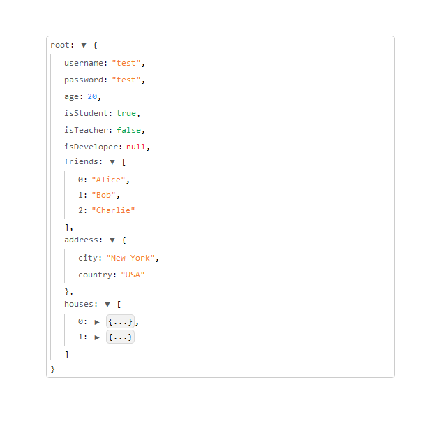

# JSON Viewer

A simple JSON viewer for the browser.

It relies on a custom JSON parser that is able to parse JSON strings and return a tree structure that can be used to render the JSON data in a more readable way.

### Packages

- `json-ast` - Allowing to parse JSON strings and return a tree structure.
- `json-viewer` - A react component that uses the `json-ast` package to render the JSON data. 

### Result

